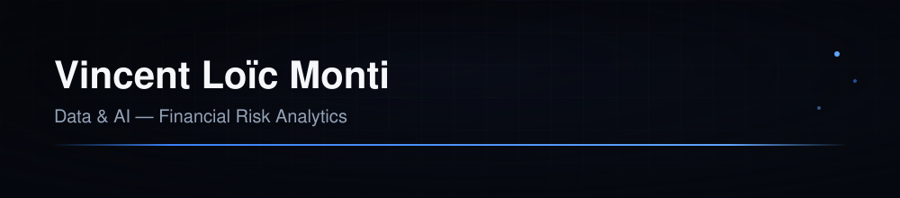

  

    

  

   

  📍 Île-de-France, France &nbsp;·&nbsp; 🎓 M2 AI & Big Data — ESTIAM Paris &nbsp;·&nbsp; 💼 ex-BEAC

    

  
  
  

 

## About Me

Data Analyst with real operational experience in international banking —
built ETL pipelines, ML models (Gradient Boosting, LSTM, Isolation Forest)
and Power BI dashboards during a Data Analyst internship at **BEAC
(Banque des États de l'Afrique Centrale)**, a central bank serving 6
CEMAC countries. Comfortable across the full loop: raw financial data →
pipeline → model → dashboard → decision.

Currently in my second year of a Master's in AI & Big Data at ESTIAM
Paris, looking for a **Data Analyst / BI / Risk Data apprenticeship for
2026–2027**.

## Core Expertise

<table>
<tr>
<td width="50%" valign="top">

**📊 Risk Analytics**
Credit scoring, fraud detection, anomaly detection, AML/CFT/KYC compliance

**🤖 Machine Learning**
Gradient Boosting, LSTM, Isolation Forest, time series forecasting, SMOTE

</td>
<td width="50%" valign="top">

**📈 Business Intelligence**
Power BI (advanced DAX, Power Query), executive dashboards

**🔧 Data Engineering**
End-to-end ETL pipelines, data cleaning at scale (500k+ records), SQL

</td>
</tr>
</table>

## Tech Stack

<table>
<tr><td><b>Languages</b></td><td>

</td></tr>
<tr><td><b>Data & BI</b></td><td>

</td></tr>
<tr><td><b>Machine Learning</b></td><td>

</td></tr>
<tr><td><b>Data Engineering</b></td><td>

</td></tr>
<tr><td><b>Development</b></td><td>

</td></tr>
</table>

## 🚀 Featured Projects

| Project | Business Problem → Result | Stack | Status |
|---|---|---|---|
| [**Credit Risk Scoring Platform**](https://github.com/vloicmonti/credit-risk-scoring-platform) | ETL on 150k client records → Gradient Boosting (SMOTE), **AUC-ROC 0.84**, real-time credit score 300–850, deployed on Streamlit Cloud | Python, scikit-learn, Streamlit, Plotly, SQLite | Completed |
| [**SIDADR — Financial Anomaly Detection**](https://github.com/vloicmonti/sidadr-financial-anomaly-detection) | Automated ETL pipeline on 500k+ multi-source financial records across 6 CEMAC countries → **-35% data error rate** | Python, SQL, MySQL | Completed |
| [**Fraud Detection & AML Compliance Platform**](https://github.com/vloicmonti/fraud-detection-aml-compliance) | Real-time financial fraud detection (Isolation Forest) with 5 regulatory compliance modules (AML, CFT, TRACFIN, KYC) | Python, Isolation Forest, Streamlit, Plotly, SQLite | Completed |
| [**Inflation Forecasting (LSTM)**](https://github.com/vloicmonti/inflation-forecasting-lstm) | Time series forecasting on real BEAC macroeconomic data (LSTM vs. linear regression) → **82% test accuracy**, executive Power BI report | Python, LSTM, Power BI, Jupyter | Completed |
| [**Macroeconomic Dashboard**](https://github.com/vloicmonti/macroeconomic-dashboard) | 5 interactive Power BI dashboards tracking regional macroeconomic indicators → adopted by 3 business units as their decision-making reference | Power BI, DAX, Power Query | Completed |
| [**Video Retention Analytics**](https://github.com/vloicmonti/video-retention-analytics) | Predicts audience drop-off from video engagement logs — built at the ESTIAM Pôle 3 Hackathon | Python | `TODO` confirm status |
| [**AfroEat**](https://github.com/vloicmonti/afroeat-platform) | Food ordering platform for Cameroonian cuisine | React, Node.js, Vite | `TODO` confirm status |

*`auditflow-financial-intelligence` is on hold — no README yet, add it
back to this table once details are available.*

## Professional Experience

**Data Analyst (Internship) — BEAC, Banque des États de l'Afrique Centrale**
*Service CNEF · Yaoundé, Cameroon · Jun–Sep 2025*

Central bank serving 6 CEMAC member countries. Delivered 4 production
data/ML solutions covering ETL, risk scoring, fraud detection and
forecasting — see Featured Projects above.

- Built and industrialized SIDADR, an automated ETL pipeline for anomaly
  and duplicate detection across 500k+ regional financial records —
  reduced data error rate by 35% and secured decision-quality data for
  6 member countries.
- Designed and deployed 5 interactive Power BI dashboards (advanced DAX,
  Power Query, data modeling) — adopted by 3 business units as their
  single reference for strategic decision-making.
- Developed LSTM and linear regression forecasting models on real
  economic time series — 28% precision improvement over baseline,
  reporting delivered to BEAC governors.
- Automated cleaning, transformation and integration of heterogeneous
  macroeconomic data (missing values, outliers, standardization) — Git
  versioned, reproducible end-to-end.

*Environment: Python (Pandas, NumPy, Scikit-learn, LSTM), SQL, MySQL,
PostgreSQL, Power BI (DAX, Power Query), ETL, Git, Jupyter Notebook,
Docker.*

## Education

- **Master, Artificial Intelligence & Big Data** — ESTIAM Paris *(2025–2027, in progress)*
- **Bachelor, Artificial Intelligence & Big Data** — Keyce Informatique & IA, Yaoundé *(2024–2025)*

## Certifications

- Data Analyst 101
- Business Analytics with Excel
- GNU/Linux
- *In progress:* Google Data Analytics (Coursera) · Microsoft Power BI PL-300

## Languages

French (native) · English (B2/C1 — technical documentation, international banking teams)

## GitHub Activity

<table>
<tr>
<td></td>
<td></td>
</tr>
</table>

## Contact

Let's build something with data.

📧 [loicmonti318@gmail.com](mailto:loicmonti318@gmail.com) · 💼 [LinkedIn](https://www.linkedin.com/in/vincent-lo%C3%AFc-monti-981641388/) · 🌐 [vloicmonti.dev](https://vloicmonti.dev)
