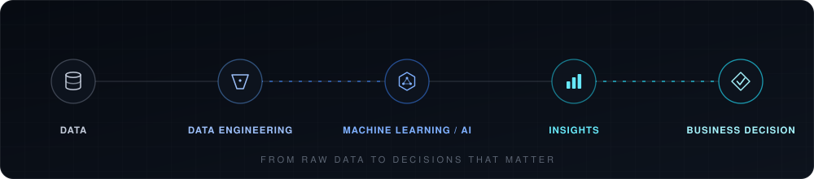
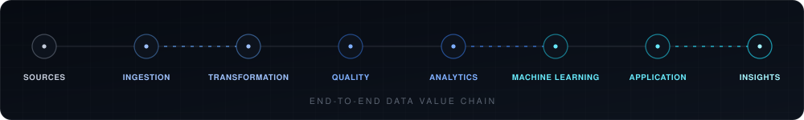

<div align="center">
  

  <br/>

  

  <br/><br/>

  <sub>🟢 Open to opportunities &nbsp;·&nbsp; 📍 Paris, France &nbsp;·&nbsp; 🎓 M2 AI & Big Data — ESTIAM Paris</sub>

  <br/><br/>

  <a href="https://github.com/vloicmonti?tab=repositories"></a>
  <a href="https://www.linkedin.com/in/vincent-lo%C3%AFc-monti-981641388/"></a>
  <a href="mailto:loicmonti318@gmail.com"></a>
</div>

<br/>

## RECRUITER SNAPSHOT

<table>
<tr><td width="160"><sub>NAME</sub></td><td>Vincent Loïc Monti</td></tr>
<tr><td><sub>POSITION</sub></td><td>AI &amp; Data Engineer</td></tr>
<tr><td><sub>EDUCATION</sub></td><td>M2 — Intelligence Artificielle &amp; Big Data, ESTIAM Paris</td></tr>
<tr><td><sub>LOCATION</sub></td><td>Paris, France</td></tr>
<tr><td><sub>EXPERIENCE</sub></td><td>BEAC — Banque des États de l'Afrique Centrale</td></tr>
<tr><td valign="top"><sub>FOCUS</sub></td><td>Data Analytics · Data Engineering · Machine Learning · Business Intelligence · Artificial Intelligence</td></tr>
<tr><td><sub>CURRENT GOAL</sub></td><td>Alternance / Data &amp; AI opportunity — 2026–2027</td></tr>
</table>

## SYSTEM PROFILE

```
$ system --profile

CORE DOMAINS
  → Data Analytics
  → Data Engineering
  → Machine Learning
  → Business Intelligence
  → Artificial Intelligence

PRIMARY STACK
  [PRIMARY]        Python · SQL · Power BI · Streamlit
  [WORKING WITH]   BigQuery · React
  [EXPERIENCE]     Databricks · Snowflake · Azure Data Factory

STATUS: open_to_opportunities  (2026-2027 apprenticeship)
```

<div align="center">
  <br/>
  
</div>

<br/>

## About Me

Turning data into strategic decisions.

I'm passionate about data, artificial intelligence and business
intelligence — I build solutions that turn complex data into reliable,
actionable, value-creating information.

I'm currently a Master's student in AI & Big Data at ESTIAM Paris,
working on projects that span the full data lifecycle: collection,
preparation, analysis, visualization and modeling.

During my time at the **Banque des États de l'Afrique Centrale (BEAC)**,
I worked on real financial data and contributed to high-impact projects.
I designed **SIDADR**, an intelligent ETL pipeline processing 500,000+
records, helping reduce errors in financial reports for the six CEMAC
member states by 35%. I also developed LSTM predictive models for
inflation forecasting (82% accuracy) and built several Power BI
dashboards to support macroeconomic indicator tracking.

I'm especially drawn to projects that combine business understanding,
data analysis and technological innovation to help organizations through
their digital transformation.

📩 Currently looking for a **2026–2027 apprenticeship** in Data
Analytics, Business Intelligence, Data Engineering or AI.

## Core Expertise

<table>
<tr>
<td width="50%" valign="top">

**📊 Risk Analytics**
Credit scoring, fraud detection, anomaly detection, AML/CFT/KYC compliance

**🤖 Machine Learning**
Gradient Boosting, LSTM, Isolation Forest, time series forecasting, SMOTE

</td>
<td width="50%" valign="top">

**📈 Business Intelligence**
Power BI (advanced DAX, Power Query), executive dashboards

**🔧 Data Engineering**
End-to-end ETL pipelines, data cleaning at scale (500k+ records), SQL

</td>
</tr>
</table>

## TECHNICAL FOCUS

<sub>`01 /`</sub> **DATA ANALYTICS**
Python · SQL · Pandas · NumPy · Data Visualization

---

<sub>`02 /`</sub> **DATA ENGINEERING**
ETL Pipelines · MySQL · PostgreSQL · BigQuery · Docker · Git

---

<sub>`03 /`</sub> **AI / MACHINE LEARNING**
Scikit-learn · TensorFlow · Keras · XGBoost · NLP · MLflow

---

<sub>`04 /`</sub> **BUSINESS INTELLIGENCE**
Power BI (DAX, Power Query) · Streamlit · Plotly

---

<sub>`05 /`</sub> **APPLICATION DEVELOPMENT**
React · Node.js

## Engineering Workflow

How a solution actually gets built, end to end — not just the modeling step.

<div align="center">
  
</div>

```
SOURCES            raw operational & financial data
INGESTION          Azure Data Factory · SQL
TRANSFORMATION     Databricks · Snowflake · BigQuery · Python
QUALITY            Python · SQL
ANALYTICS          SQL · Power BI
MACHINE LEARNING   Python · Azure ML
APPLICATION        Streamlit
INSIGHTS           Power BI
```

## FEATURED SYSTEMS

<table>
<tr>
<td width="50%" valign="top">


**Credit Risk Scoring Platform**

ETL on 150k client records → Gradient Boosting (SMOTE) → **AUC-ROC 0.84**, real-time 300–850 score, deployed on Streamlit Cloud.

`Python` `scikit-learn` `Streamlit` `SQLite`

[GitHub →](https://github.com/vloicmonti/credit-risk-scoring-platform)

</td>
<td width="50%" valign="top">


**SIDADR — Financial Anomaly Detection**

Automated ETL pipeline on 500k+ multi-source records across 6 CEMAC countries → **-35% data error rate**.

`Python` `SQL` `MySQL`

[GitHub →](https://github.com/vloicmonti/sidadr-financial-anomaly-detection)

</td>
</tr>
<tr>
<td width="50%" valign="top">


**Fraud Detection & AML Compliance**

Real-time transaction scoring (Isolation Forest) with 5 regulatory modules — AML, CFT, TRACFIN, KYC.

`Python` `Isolation Forest` `Streamlit` `Plotly`

[GitHub →](https://github.com/vloicmonti/fraud-detection-aml-compliance)

</td>
<td width="50%" valign="top">


**Inflation Forecasting (LSTM)**

LSTM vs. linear regression on real BEAC macroeconomic time series → **82% test accuracy**, executive Power BI report.

`Python` `LSTM` `Power BI`

[GitHub →](https://github.com/vloicmonti/inflation-forecasting-lstm)

</td>
</tr>
<tr>
<td width="50%" valign="top">


**Macroeconomic Dashboard**

5 interactive Power BI dashboards → **adopted by 3 business units** as their decision-making reference.

`Power BI` `DAX` `Power Query`

[GitHub →](https://github.com/vloicmonti/macroeconomic-dashboard)

</td>
<td width="50%" valign="top">


**Video Retention Analytics**

Predicts audience drop-off from video engagement logs — built at the ESTIAM Pôle 3 Hackathon.

`Python`

[GitHub →](https://github.com/vloicmonti/video-retention-analytics)

</td>
</tr>
</table>

<sub>Also on GitHub: `afroeat-platform` (web) · `auditflow-financial-intelligence` (on hold) — see [full list](https://github.com/vloicmonti?tab=repositories).</sub>

## ARCHITECTURE LAB

How three of the systems above are actually built — real stages, real stack, nothing invented.

**CREDIT RISK SCORING**
```
DATA → INGESTION → PREPROCESSING → FEATURE ENGINEERING → ML MODEL → RISK SCORING → STREAMLIT APPLICATION
```
`Python` `Pandas` `scikit-learn (Gradient Boosting)` `SMOTE` `Streamlit` `SQLite`

**SIDADR**
```
MULTI-SOURCE DATA → INGESTION → SCHEMA STANDARDIZATION → DUPLICATE DETECTION → ANOMALY DETECTION → VALIDATED DATASET
```
`Python` `SQL` `MySQL`

**FRAUD DETECTION & AML**
```
TRANSACTION DATA → PREPROCESSING → ANOMALY SCORING (ISOLATION FOREST) → COMPLIANCE MODULES (AML · CFT · TRACFIN · KYC) → DASHBOARD
```
`Python` `Isolation Forest` `Streamlit` `Plotly` `SQLite`

## Professional Experience

```
2025
 │
 └── BEAC — Banque des États de l'Afrique Centrale
       Data · Finance · Technology
       Jun – Sep 2025 · Yaoundé, Cameroon
```

<table>
<tr><td width="180"><b>ORGANIZATION</b></td><td>BEAC — Banque des États de l'Afrique Centrale, central bank serving 6 CEMAC member countries</td></tr>
<tr><td><b>ROLE</b></td><td>Data Analyst (Internship), Service CNEF</td></tr>
<tr><td><b>DOMAIN</b></td><td>Data · Finance · Technology</td></tr>
<tr><td valign="top"><b>MISSIONS</b></td><td>

- Built and industrialized SIDADR, an automated ETL pipeline for anomaly and duplicate detection across 500k+ regional financial records
- Designed and deployed 5 interactive Power BI dashboards (advanced DAX, Power Query, data modeling)
- Developed LSTM and linear regression forecasting models on real economic time series
- Built a credit scoring pipeline (Gradient Boosting + SMOTE) and a real-time fraud detection platform (Isolation Forest) covering AML, CFT, TRACFIN and KYC checks
- Automated the cleaning, transformation and integration of heterogeneous macroeconomic data — Git-versioned, reproducible end-to-end

</td></tr>
<tr><td valign="top"><b>PROBLEMS SOLVED</b></td><td>

- Fragmented, multi-source financial data across 6 countries undermining data quality and trust
- No single reference for macroeconomic indicators across business units
- Inflation forecasting relying on simple baseline methods
- Credit risk and fraud exposure without automated scoring or detection

</td></tr>
<tr><td valign="top"><b>DELIVERABLES</b></td><td>

- **SIDADR** — -35% data error rate, decision-quality data for 6 member countries
- **5 Power BI dashboards** — adopted by 3 business units as their decision-making reference
- **Inflation forecasting model** — 82% test accuracy, reporting delivered to BEAC governors
- **Credit Risk Scoring Platform** — AUC-ROC 0.84, deployed on Streamlit Cloud
- **Fraud Detection & AML Compliance Platform** — deployed with integrated database

*(full detail on each — see [Engineering Workflow](#engineering-workflow) and [Featured Systems](#featured-systems) above)*

</td></tr>
<tr><td><b>TECHNOLOGIES</b></td><td>

`Python` `Pandas` `NumPy` `Scikit-learn` `LSTM` `SQL` `MySQL` `PostgreSQL` `Power BI` `DAX` `Power Query` `ETL` `Git` `Jupyter Notebook` `Docker`

</td></tr>
</table>

## Education

- **Master, Artificial Intelligence & Big Data** — ESTIAM Paris *(2025–2027, in progress)*
- **Bachelor, Artificial Intelligence & Big Data** — Keyce Informatique & IA, Yaoundé *(2024–2025)*

## Certifications

- Data Analyst 101
- Business Analytics with Excel
- GNU/Linux
- *In progress:* Google Data Analytics (Coursera) · Microsoft Power BI PL-300

## Languages

French (native) · English (B2/C1 — technical documentation, international banking teams)

## GitHub Activity

<div align="center">
<table>
<tr>
<td></td>
<td></td>
</tr>
</table>
</div>

---

<div align="center">

<sub>SYSTEM STATUS</sub>

 **ONLINE**

<br/><br/>

*"Building data-driven solutions from data to intelligence."*

<br/>

[LinkedIn](https://www.linkedin.com/in/vincent-lo%C3%AFc-monti-981641388/) · [Email](mailto:loicmonti318@gmail.com)

</div>
